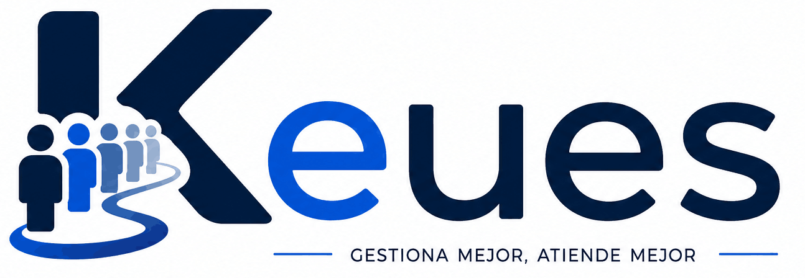

[](README_EN.md) · [](README.md)

<p align="center">
  
</p>

<p align="center">
  <b>Queue and ticket management system</b> for businesses, clinics, public administrations and any organization that needs to organize customer service.
</p>

<p align="center">
  
  
  
  <br>
  
  
  
  
  
  
</p>

<p align="center">
  Official website and documentation: <b><a href="https://www.keues.dev">https://www.keues.dev</a></b>
</p>

> ✅ **Version 1.0.** API, dashboard and queue/ticket flows are functional, with an automated test suite (xUnit) and JWT-protected administration endpoints. Physical ticket printing in TicketMachine is still in development.

---

## Table of contents

- [How it works](#how-it-works)
- [Repository ecosystem](#repository-ecosystem)
- [Flow types](#flow-types)
- [Features](#features)
- [Architecture](#architecture)
- [Tech stack](#tech-stack)
- [Project structure](#project-structure)
- [Installation](#installation)
- [API documentation](#api-documentation)
- [Project status](#project-status)
- [License](#license)

---

## How it works

**Keues** is built around a central **.NET API** that keeps all state (locations, queues, counters, tickets and devices) and pushes changes to screens **in real time** via **SignalR**. Four applications connect to it:

```
                   ┌───────────────────────────────┐
                   │  Dashboard · React (admin)     │
                   └───────────────┬───────────────┘
                                   │ REST + JWT
                   ┌───────────────▼───────────────┐
                   │        Keues API · .NET 10     │
                   │    REST  +  SignalR /devices   │
                   └──────┬──────────────────┬──────┘
                          │                  │
             ┌────────────▼─────┐   ┌────────▼──────────┐
             │  TicketMachine   │   │  Monitors · TV     │
             │  (self-service)  │   │  (read-only)       │
             └──────────────────┘   └───────────────────┘
             ┌──────────────┐
             │  Counter     │
             │  (service    │
             │   desk)      │
             └──────────────┘
```

A typical service cycle:

1. A customer picks a service on the **ticket machine** and gets their turn number (e.g. `P-001`).
2. An operator at their **counter** presses "Call next ticket".
3. The API picks the next ticket based on **priority, weight and aging** across the queues and broadcasts it over SignalR.
4. **Monitors** (TV screens) show the ticket instantly, with no page reload.
5. When done, the operator marks the ticket as attended (or the desk as free) and the monitors update again.

---

## Repository ecosystem

| Repository | What it is | Role |
|---|---|---|
| [**Keues**](https://github.com/HastaCs/Keues) *(this one)* | REST API + SignalR and admin dashboard | Core of the system: stores state and coordinates everything |
| [**Keues-Counter**](https://github.com/HastaCs/Keues-Counter) | Desktop app (Electron) for each service desk | The operator calls the next ticket, attends, marks free or makes manual calls |
| [**Keues-Monitors**](https://github.com/HastaCs/Keues-Monitors) | TV/display screens app (Electron) | Shows the current ticket, the last free desk and manual calls in real time (read-only) |
| [**Keues-TicketMachine**](https://github.com/HastaCs/Keues-TicketMachine) | Self-service kiosk (Electron) | Customers pick a service and get their ticket number |

---

## Flow types

Each location defines **flows** that determine how the machines, counters and monitors behave:

| Type | Use case | Behavior |
|---|---|---|
| `TicketMachine` | Butcher, fishmonger, greengrocer, banks, clinics… | Customers take a ticket at the terminal and the desk calls the next turn |
| `SetFree` | Desks without tickets (supermarket style) | The desk marks itself as free and the monitor shows it |
| `ManualCall` | Desks with manual numbers | The operator moves the number up/down (+1 / −1 / +10 / −10) and the monitor shows it |

---

## Features

- **Multi-location:** each establishment has its own queues, counters, flows and devices.
- **Smart queues:** priority, **weight** (attention ratio between queues, e.g. 1 ticket of A for every 3 of B) and **aging** that automatically raises the priority of tickets that have been waiting for a long time.
- **Counters:** each desk has a name, code and color, linked to one or more queues.
- **Tickets:** issuing, calling the next one, attending and cancelling, with numbering control (`NextNumber` / `MaxValue`).
- **Real time (SignalR):** devices register on the `/devices` hub and monitors update instantly (`TicketCalled`, `TicketAttended`, `CounterFree`, `ReloadFlow`).
- **Admin dashboard:** React + Mantine SPA for full management of locations, queues, counters, flows, tickets and devices.
- **Security:** JWT auth in an `HttpOnly` cookie, first-admin setup, login and **email (SMTP)** password recovery.
- **Documented API:** auto-generated OpenAPI/Swagger.
- **Easy deployment:** a single Docker image with the dashboard and the API, persistent data in `/app/data`.

---

## Architecture

The backend follows a **Clean Architecture** with dependencies pointing inward:

```
┌──────────────────────────────────────────────────────────┐
│  Keues.Dashboard   React SPA (web administration)          │
├──────────────────────────────────────────────────────────┤
│  Keues.API        HTTP endpoints + SignalR hub + SPA (prod)│
├──────────────────────────────────────────────────────────┤
│  Keues.Application   Use cases                             │
├──────────────────────────────────────────────────────────┤
│  Keues.Domain       Entities and business rules            │
├──────────────────────────────────────────────────────────┤
│  Keues.Infrastructure  EF Core · SQLite · JWT · SMTP       │
└──────────────────────────────────────────────────────────┘
```

---

## Tech stack

### Backend

- ASP.NET Core (.NET 10)
- Entity Framework Core + SQLite
- SignalR (real time)
- JWT authentication (HttpOnly cookie)
- OpenAPI / Swagger
- Testing: xUnit (use cases + HTTP integration with in-memory SQLite)

### Frontend

- React 19 + TypeScript
- Vite 8
- Mantine 9 + Tabler Icons
- React Router · i18next

### Deployment

- Docker · Docker Compose

---

## Project structure

```
Keues.sln
├── Keues.API/              # REST API + SignalR hub + SPA (production)
├── Keues.Application/      # Use cases
├── Keues.Domain/           # Entities and business rules
├── Keues.Infrastructure/   # EF Core, SQLite, JWT, SMTP email
├── Keues.Tests/            # Test suite (xUnit): use cases + API
├── Keues.Dashboard/        # React SPA (admin dashboard)
├── scripts/                # utilities (export-openapi.sh, etc.)
└── docs/                   # generated documentation (openapi.json)
```

---

## Installation

### Docker (recommended)

```bash
docker run -d \
  --name keues \
  -p 8080:8080 \
  -v "$(pwd)/data:/app/data" \
  gorerecord/keues:latest
```

Open **http://localhost:8080**: on first start, a `config.json` (with a random JWT key) and the SQLite database are created, and the dashboard will guide you through creating the **first administrator**.

Or with Docker Compose:

```yaml
services:
  keues:
    image: gorerecord/keues:latest
    container_name: keues
    ports:
      - "8080:8080"
    volumes:
      - ./data:/app/data
    environment:
      KEUES_DASHBOARD_URL: "http://localhost:8080"
    restart: unless-stopped
```

### Local development

Requirements: **.NET 10 SDK** and **Node.js + pnpm**.

```bash
# 1) API (.NET 10)
dotnet run --project Keues.API
# → http://localhost:5125 · OpenAPI at http://localhost:5125/openapi/v1.json

# 2) Dashboard (React)
cd Keues.Dashboard
pnpm install
pnpm dev
```

> Note: the Vite proxy points to `http://localhost:8080` (configured in `Keues.Dashboard/vite.config.mjs`). If you run the API on another port, adjust that line.

The database is created and migrated automatically on startup (`db.Database.Migrate()`), in `Keues.API/data/keues.db`.

---

## API documentation

- In development, the OpenAPI document is available at `http://localhost:5125/openapi/v1.json`.
- You can regenerate it into `docs/openapi.json` with:

```bash
./scripts/export-openapi.sh
```

---

## Testing

The suite covers the **use cases** (business rules: ticket numbering, priority/aging/weight in ticket calling, auth, etc.) and the **API** (real HTTP integration with `WebApplicationFactory`, including security and malformed input). It uses an **in-memory SQLite** database with `dotnet test`:

```bash
dotnet test Keues.Tests
```

---

## Project status

### Backend (API)

- [x] Clean Architecture
- [x] Entity Framework Core + SQLite + automatic migrations
- [x] CRUD for locations, queues, counters, flows, tickets and devices
- [x] Ticket issuing (`POST /api/queues/{id}/new-ticket`)
- [x] Next-ticket calling (priority, weight and aging)
- [x] Attend / cancel / manual call / free desk
- [x] Real-time notifications (SignalR)
- [x] JWT auth + SMTP password recovery
- [x] JWT-protected administration endpoints (`[Authorize]`)
- [x] OpenAPI / Swagger
- [x] Automated test suite (xUnit): 130+ use case and API tests

### Dashboard

- [x] First-admin setup, login and password reset
- [x] Location management and per-location dashboard
- [x] Queue, counter, flow and ticket management
- [x] Device management (machines, counters, monitors)
- [x] Multi-language (EN/ES) and light/dark theme

### Clients (Electron)

- [x] Keues-Counter: call next, attend, free, manual call
- [x] Keues-Monitors: current ticket, free desk, manual calls
- [x] Keues-TicketMachine: service menu and ticket issuing
- [ ] Physical ticket printing (POS printer) in TicketMachine

---

## License

This project is released under the **MIT License**. See the [LICENSE](LICENSE) file.

---

Made with 💙 by [HastaCs](https://github.com/HastaCs).
